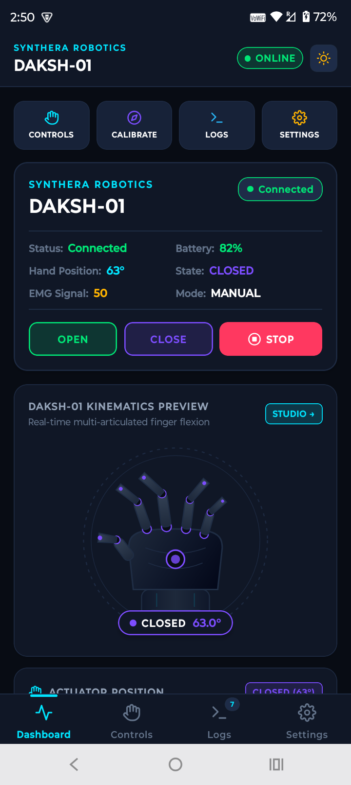

# Synthera Prosthetic Hand Controller (DAKSH-01)
### Simulated ESP32-Based Myoelectric Prosthetic Hand Mobile Application
**Developed for Internship Evaluation at Synthera Robotics Pvt. Ltd.**

---

## 📋 Submission Details (Section 14)

| Submission Item | Link |
|---|---|
| **GitHub Repository** | [https://github.com/rosh2004229/Synthera-DAKSH-01](https://github.com/rosh2004229/Synthera-DAKSH-01) |
| **View / Live Demo Video** | [Watch Demo Video (daksh01_demo.mp4)](./daksh01_demo.mp4) |

---

## 1. Project Overview

The **Synthera Prosthetic Hand Controller** is a mobile medical-device dashboard engineered with React Native and TypeScript to monitor, calibrate, and command the **DAKSH-01** multi-articulated bionic prosthetic hand. 

Since physical embedded hardware is not attached, the application features an integrated, software-based **ESP32 Microcontroller & Physics Simulation Engine** that accurately models:
- Multi-joint kinematic finger flexion and extension (0.0° to 63.0°)
- Real-time physiological surface EMG (Electromyography) biopotential generation with mains noise, baseline drift, and muscle burst spikes
- Dynamic dual-cell Li-Po battery discharge curves (idle vs. active servo motor load)
- State machine automation, edge-triggered myoelectric contraction control, and an uncompromised Emergency STOP priority interlock.

---

## 2. System Architecture

The software is structured around clean dependency inversion, isolating UI rendering from state management, hardware protocol abstraction, and physical kinematics simulation.

```
┌─────────────────────────────────────────────────────────────┐
│                 React Native Presentation UI                │
│    (Dashboard, Control Studio, Calibration Wizard, Logs)     │
└──────────────────────────────┬──────────────────────────────┘
                               │ Dispatches / Selectors
                               ▼
┌─────────────────────────────────────────────────────────────┐
│                     Redux Toolkit Store                     │
│        (deviceSlice, settingsSlice, logsSlice)              │
└──────────────────────────────┬──────────────────────────────┘
                               │ State Bridge
                               ▼
┌─────────────────────────────────────────────────────────────┐
│                    DeviceService (Singleton)                │
│            Coordinates Commands, Telemetry & Logs           │
└──────────────────────────────┬──────────────────────────────┘
                               │ Implements ICommunicationService
                               ▼
┌─────────────────────────────────────────────────────────────┐
│                      MockESP32Service                       │
│    (Simulates UART/BLE Handshakes, Latency, & Packet IO)    │
└──────────────────────────────┬──────────────────────────────┘
                               │ Controls Kinematics & Sensors
                               ▼
┌─────────────────────────────────────────────────────────────┐
│                  ProstheticHandSimulator                    │
│   (20Hz Kinematics, Servo Speed, EMG Generator, Discharge)  │
└─────────────────────────────────────────────────────────────┘
```

---

## 3. Communication Abstraction & Future BLE Integration

The core communication architecture relies on the `ICommunicationService` interface. Swapping the mock firmware engine for physical ESP32 hardware requires zero modifications to UI screens or Redux slices.

```typescript
// Interface Contract: src/services/ICommunicationService.ts
export interface ICommunicationService {
  connect(): Promise<boolean>;
  disconnect(): Promise<boolean>;
  reconnect(): Promise<boolean>;
  sendCommand(command: DeviceCommand, payload?: any): Promise<boolean>;
  setOperatingMode(mode: OperatingMode): Promise<boolean>;
  subscribeTelemetry(listener: (t: DeviceTelemetry) => void): () => void;
  subscribeConnectionStatus(listener: (s: ConnectionStatus) => void): () => void;
}
```

### Future Physical BLE GATT Service Layout:
When compiling for physical BLE hardware using `react-native-ble-plx`, `BLEDeviceService` maps the abstraction to standard GATT Services and Characteristics:

| Characteristic | UUID | Type | Description |
|---|---|---|---|
| **Service UUID** | `0000ffe0-0000-1000-8000-00805f9b34fb` | Primary Service | Synthera DAKSH-01 Main GATT Service |
| **Command Pipe** | `0000ffe1-0000-1000-8000-00805f9b34fb` | Write / WriteNoResp | Opcode packets (`OPEN`, `CLOSE`, `STOP`, `CALIBRATE`) |
| **Telemetry Stream** | `0000ffe2-0000-1000-8000-00805f9b34fb` | Notify (20Hz) | Packed binary stream (`Angle`, `Speed`, `State`, `Temp`) |
| **EMG Bio Stream** | `0000ffe3-0000-1000-8000-00805f9b34fb` | High-Speed Notify | Raw ADC sample values (µV) |
| **Battery Service** | `00002a19-0000-1000-8000-00805f9b34fb` | Read / Notify | Standard SIG Battery Level (0-100%) |

---

## 4. Key Features & Simulation Mechanics

### 1. Real-Time Prosthetic Kinematics
- **Range of Motion**: Fully Open = `0.0°`, Fully Closed = `63.0°`.
- **Dynamic Motion Interpolation**: Position updates at 20Hz based on configured angular velocity (default 45°/second).
- **Articulated SVG Bionic Hand**: All five digits (Thumb, Index, Middle, Ring, Pinky) articulate and rotate proportionally to the actuator position.
- **States**: `OPEN`, `CLOSING`, `CLOSED`, `OPENING`, `HOLDING`, `STOPPED`, `CALIBRATING`, `ERROR`.

### 2. Myoelectric (EMG) Sensor Simulation & Oscilloscope
- **Physiological Model**: Generates baseline resting potential (40–60 µV), 50Hz environmental harmonics, Gaussian noise, and muscle contraction peaks.
- **Real-Time Oscilloscope Waveform**: SVG-based continuous rolling waveform displaying the last 40 samples with visual threshold lines and peak indicators.
- **Edge-Triggered Control**: Detects rapid threshold crossing with a refractory cooldown period (850ms) to prevent unintended repetitive triggers.

### 3. Three Operating Modes
1. **MANUAL Mode**: Direct tactile buttons for `OPEN HAND` (0°), `CLOSE HAND` (63°), and `EMERGENCY STOP`.
2. **EMG Mode**: Hand flexion toggles between open and closed whenever biopotential crosses the threshold (e.g., 120 µV). Features a **"Trigger Simulated Contraction"** testing button.
3. **AUTO Mode**: Cyclic automation cycle (`OPEN` $\rightarrow$ `HOLD for 1.8s` $\rightarrow$ `CLOSE` $\rightarrow$ `HOLD for 1.8s` $\rightarrow$ `OPEN`).

### 4. Safety Architecture & Emergency STOP
- **Emergency STOP Priority**: Pressing STOP immediately halts servo actuation at the exact current position and overrides Auto and EMG modes.
- **Critical Battery Cutoff**: If battery level drops to $\le 5\%$, an automated safety interlock inhibits actuator motion to prevent deep-discharge cell degradation.
- **Validation Bounds**: Prevents setting min $\ge$ max angle, zero-length motion spans, or negative battery levels.

### 5. Calibration Wizard
- 3-step guided calibration flow to capture custom mechanical open stops and grip closed positions.
- Micro-nudge angle controls (-5°, -1°, +1°, +5°).
- Persistent storage to `AsyncStorage`.

### 6. Diagnostic Logs & Theming
- Structured real-time event logger (`COMMAND`, `SENSOR`, `WARNING`, `SYSTEM`, `ERROR`, `CALIBRATION`).
- Filter chips, search bar, and log memory clearance.
- Full dark mode (Robotics Cyan / Deep Slate) and light mode support with persistent user preference.

---

## 5. Folder Structure

```
c:\React Native\Currentlyapp/
├── App.tsx                       # Root Provider, Initialization & Storage Hydration
├── src/
│   ├── types/
│   │   ├── device.ts             # Telemetry, Commands, States, OperatingModes
│   │   ├── settings.ts           # DeviceSettings, CalibrationData
│   │   └── logs.ts               # DeviceLog, LogType
│   ├── theme/
│   │   ├── colors.ts             # Dark/Light palettes with neon cyan accents
│   │   ├── spacing.ts            # Spacing & border radius tokens
│   │   ├── typography.ts         # Typography styles
│   │   └── theme.ts              # Unified theme helper
│   ├── storage/
│   │   └── storage.ts            # AsyncStorage persistence wrapper
│   ├── services/
│   │   ├── ICommunicationService.ts    # Hardware abstraction interface
│   │   ├── ProstheticHandSimulator.ts  # 20Hz Kinematics & EMG Physics Simulation
│   │   ├── MockESP32Service.ts         # Simulated ESP32 UART/GATT link
│   │   ├── BLEDeviceService.ts         # Future BLE GATT Architecture
│   │   └── DeviceService.ts            # Singleton orchestrator for Redux
│   ├── store/
│   │   ├── store.ts              # Redux Toolkit store & typed hooks
│   │   ├── deviceSlice.ts        # Telemetry & connection status slice
│   │   ├── settingsSlice.ts      # Device parameters & calibration slice
│   │   └── logsSlice.ts          # Event logger slice
│   ├── hooks/
│   │   ├── useDevice.ts          # High-level reactive device control hook
│   │   ├── useTheme.ts           # Active theme & dark mode toggle hook
│   │   └── useEMGStream.ts       # Real-time EMG buffer analysis hook
│   ├── components/
│   │   ├── common/
│   │   │   ├── Header.tsx              # Brand header with status badge
│   │   │   ├── StatusCard.tsx          # Reusable glassmorphic container
│   │   │   ├── DeviceStatusBadge.tsx   # Animated pulsing status indicator
│   │   │   ├── WarningBanner.tsx       # Safety & low-battery banners
│   │   │   ├── ControlButton.tsx       # Tactile button component
│   │   │   └── SvgIcons.tsx            # Pure SVG vector icons
│   │   ├── dashboard/
│   │   │   ├── BatteryCard.tsx         # Battery gauge, voltage, runtime
│   │   │   ├── HandPositionCard.tsx    # Angle meter & range progress track
│   │   │   ├── EMGCard.tsx             # Live EMG readout & stats
│   │   │   └── EMGChart.tsx            # Real-time SVG oscilloscope graph
│   │   ├── controls/
│   │   │   ├── HandVisualization.tsx   # Articulated SVG robotic hand kinematics
│   │   │   ├── ModeSelector.tsx        # Segmented mode switcher
│   │   │   ├── ManualControls.tsx      # Open, Close, Emergency Stop
│   │   │   ├── EMGControlPanel.tsx     # EMG sensitivity & flex test button
│   │   │   └── AutoModePanel.tsx       # Cyclic sequence stepper visualizer
│   │   ├── logs/
│   │   │   └── LogItem.tsx             # Categorized log item
│   │   └── settings/
│   │       └── SettingRow.tsx          # Parameter stepper & validation row
│   ├── screens/
│   │   ├── DashboardScreen.tsx   # Primary telemetry & control dashboard
│   │   ├── ControlsScreen.tsx    # Mode switcher & control studio
│   │   ├── CalibrationScreen.tsx # 3-step actuator calibration wizard
│   │   ├── LogsScreen.tsx        # Diagnostic event logger
│   │   └── SettingsScreen.tsx    # Parameter configuration & test bench
│   ├── navigation/
│   │   └── RootNavigator.tsx     # Bottom tabs & calibration modal stack
│   └── utils/
│       └── validation.ts         # Numeric & boundary validation utilities
└── __tests__/
    ├── Simulator.test.ts         # Kinematics, Emergency STOP, EMG tests
    ├── DeviceService.test.ts     # Command execution & connection tests
    ├── ReduxStore.test.ts        # Redux reducers & telemetry dispatch tests
    ├── Validation.test.ts        # Form & calibration validation tests
    └── App.test.tsx              # Component render & bootstrap tests
```

---

## 6. Installation and Running

### Prerequisites
- Node.js $\ge$ 20.x
- Android SDK & Java 17+ (for running on Android emulator / physical phone)

### 1. Install Dependencies
```bash
npm install
```

### 2. Start Metro Bundler
```bash
npm start
```

### 3. Run on Android
```bash
npm run android
```

### 4. Run Automated Test Suite
```bash
npm test
```

### 5. Run TypeScript Check
```bash
npx tsc --noEmit
```

---

## 7. How to Build Android Release APK

To build a standalone APK for testing on physical Android devices:

```bash
cd android
./gradlew assembleRelease
```
The output APK will be generated at:
`android/app/build/outputs/apk/release/app-release.apk`

---

## 8. Suggested 3-Minute Demo Flow for Reviewers

1. **Dashboard Overview**: Launch the app. Observe the active `DAKSH-01` device header, battery at 82%, angle at 45.0°, and the live real-time SVG EMG oscilloscope graph updating continuously at 20Hz.
2. **Kinematic Actuation**: Tap `CLOSE HAND`. Observe the smooth angle interpolation towards 63.0° and how all 5 robotic fingers flex inward in the SVG visualization.
3. **Emergency Stop Interlock**: Tap `OPEN HAND`, then immediately press `EMERGENCY STOP`. Verify the motion halts instantly at the intermediate angle with state `STOPPED`.
4. **Myoelectric EMG Mode**: Switch to the `Controls` tab and select `EMG BIO`. Tap `TRIGGER SIMULATED CONTRACTION (280µV)`. Observe the contraction spike and how the hand automatically toggles position.
5. **Auto Mode Routine**: Select `AUTO` mode. Observe the 4-stage cyclic sequence (`OPEN` $\rightarrow$ `HOLD` $\rightarrow$ `CLOSE` $\rightarrow$ `HOLD`).
6. **Calibration Wizard**: Tap `START CALIBRATION`. Use the nudge buttons to test custom angle boundaries (e.g. Min: 0.0°, Max: 60.0°) and save the calibration.
7. **Simulation Test Bench & Settings**: Open `Settings`. Test simulating a BLE disconnection and observe the warning banner. Tap `RECONNECT` and witness the simulated reconnection handshake.
8. **Diagnostic Logs**: Navigate to `Logs` tab to review the timestamped command and sensor events.

---

## 9. Application Screenshots

| Dashboard & Telemetry | Control Studio & Presets | Actuator Calibration |
|:---:|:---:|:---:|
|  |  |  |

| Diagnostic Logs | Settings & Simulator |
|:---:|:---:|
|  |  |

---

## 10. Known Limitations

- **Simulated Hardware**: The application does not require a physical ESP32 or mechanical servos. All kinematics, biopotentials, and battery curves are simulated in software.
- **BLE Ready**: BLE communication is architected via `ICommunicationService` and `BLEDeviceService` for drop-in integration when hardware is manufactured.
